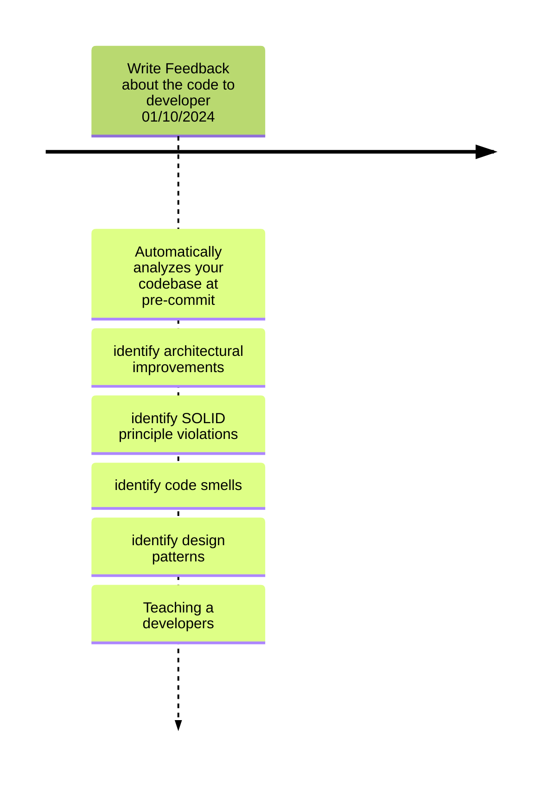
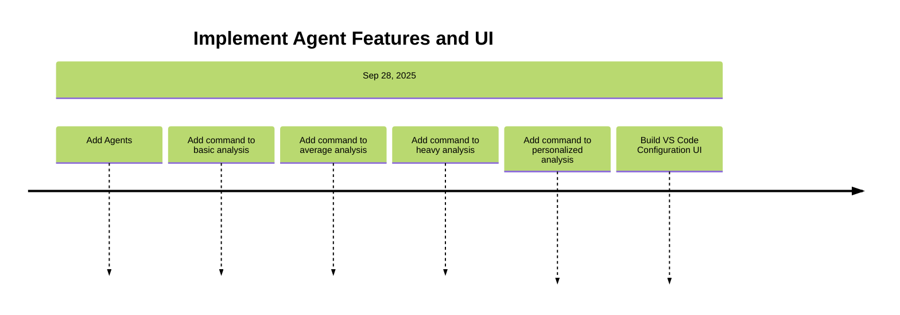
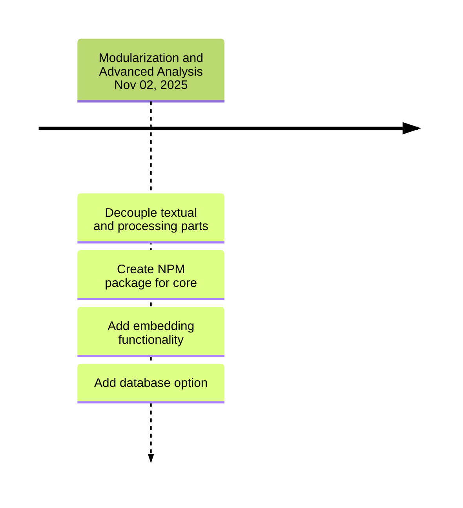
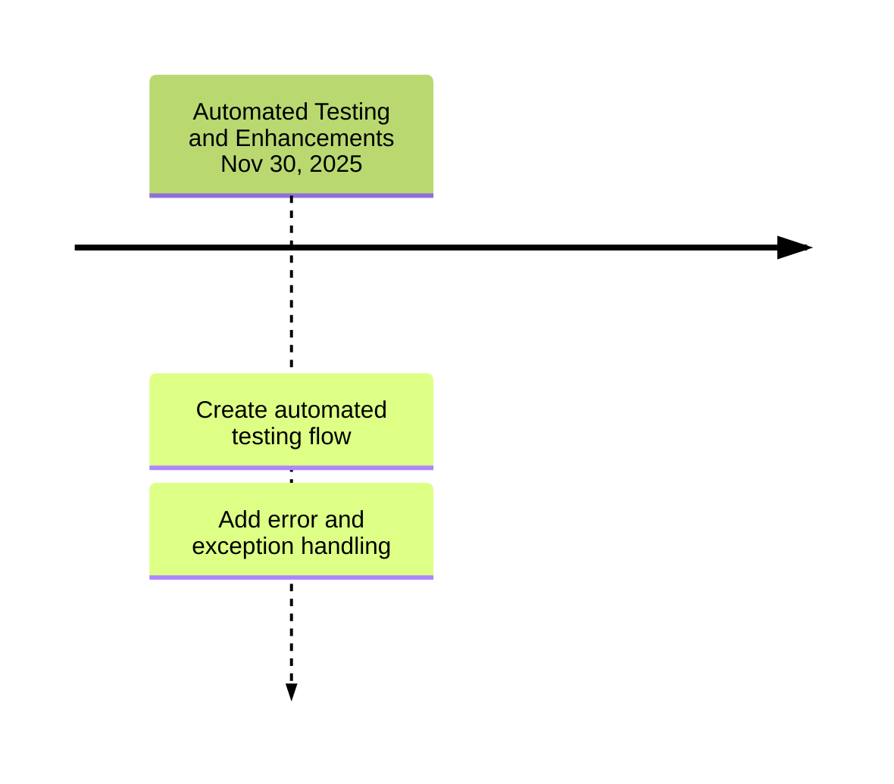

Presents the project`s developing planning.

## Backlog

| ID | Feature | Description | Importance |Proposal|
| -- | ------- | ----------- |----------- |--------|
| 1  | Architectural Improvements| Replace the JSON file with a more robust data structure and improve the internal code architecture. | 100 |Improve software developmen quality in 10%Increase project security and maintainability by 30%. |
| 2  | Analysis Improvements | Add commands for different types of analysis, code documentation, and hierarchical analysis between agents. | 95 |Increase the depth and versatility of the analysis by 40%. |
| 3  | Configuration Interface | Create a dedicated configuration interface within VS Code for a better user experience. | 90 | Improve the user experience and customization of the extension by 25%. |
| 4  | Automated Testing | Implement an automated testing pipeline to ensure code stability and quality. | 85 |Reduce the bug and failure rate by 50%. |
| 5  | Modularization and Core | Decouple the textual part from the processing part and create an NPM package for the core. | 80 | Facilitate the reuse and development of the extension's core. |
| 6  | Embedding and Database | Add embedding functionality for advanced analysis and the option to save information in a database. | 75 | Increase the intelligence and analysis history of the extension by 20%. |

## General planning

* Release 1.0 (Done): Pre-commit code analysis and feedback.
* Release 2.0 (In Progress): Adding analysis and configuration features.
* Release 3.0 (Undefined): Refactoring and architectural improvements.
* Release 4.0 (Undefined): Implementing tests and advanced features.

## Release 1.0 - 10/07/2025

* **Goal**: Write Feedback about the code to developer.

  * **Features**: 
    * Automatically analyzes your codebase at pre-commit
    * identify architectural improvements
    * identify SOLID principle violations
    * identify code smells
    * identify design patterns
    * **Problems**:
      * Spend much time to analysis many code
    * **Oportunity**
      * Develop our IA to improve time and no spend money
  
  * **Deadline I**  01/10/2023: Send Feedback about a code to developer.      

## Release 2.0 - September 28, 2025

  * **Goal**: Add commands for different types of analysis and Create a dedicated configuration interface.

    * **Features**: ID 2, ID 3

    * Add command to basic analysis.

    * Add command to average analysis.

    * Add command to heavy analysis.

    * Add command to personalized analysis.

    * Create a dedicated configuration interface.

    * **Problems**:

        The current system lacks advanced analytical capabilities and a user-friendly configuration interface.

    * **Opportunity**:

        Implementing these features will make the extension more powerful, context-aware, and easier for developers to use.

    * Deadline: September 28, 2025: All new features implemented and ready for testing.

## Release 3.0 - November 02, 2025

  * **Goal**: Refactoring and architectural improvements.

    * **Features**: ID 5, ID 6

    * Decouple the textual part from the processing part.

    * Create an NPM package for the project's core.

    * Add embedding functionality for advanced analysis.

    * Add an option to save information in a database.

    * **Problems**:

        The current architecture is tightly coupled, making it difficult to maintain and reuse, and it lacks the ability to perform deep, historical analysis.

    * **Opportunity**:

        By modularizing the core and adding embeddings and a database, the extension will become more scalable, maintainable, and intelligent, providing richer, more powerful insights over time.

    * Deadline: November 02, 2025: All new features implemented and ready for testing.

## Release 4.0 - November 30, 2025

  * **Goal**: Implementing an automated testing flow and enhancing code quality with robust error handling.

    * **Features**: ID 4

    * Create an automated testing flow for the project itself.

    * Add error and exception handling in the LLM payload.

    * **Problems**:

        The lack of automated tests may lead to bugs and instability.

    * **Opportunity**:

        A robust testing flow will ensure the project's stability and quality, reducing the rate of bugs and failures.

    * Deadline: November 30, 2025: All new features implemented and ready for testing.

