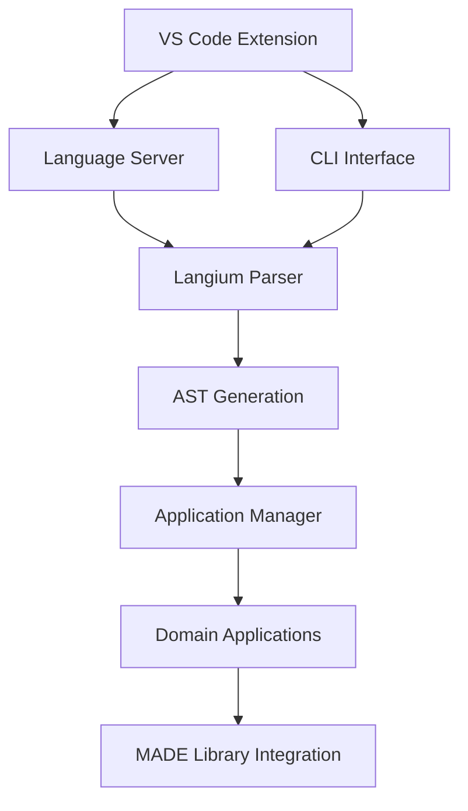

# Tool Architecture

The MADE Tool (`leds-tools-made`) is built as a VS Code extension with CLI support, using Langium for DSL processing.

## Architecture Overview



## Core Components

### 1. Language Definition (`language/`)

#### DSL Grammar (`made.langium`)
```langium
grammar Made

entry Model:
    (project=Project)
    (components+=(Team|Process|Backlog|TimeBox|Roadmap))*
```

#### Key Files
- `made.langium` - Main grammar definition
- `backlog.langium` - Backlog-specific grammar
- `team.langium` - Team structure grammar
- `process.langium` - Process definition grammar
- `roadmap.langium` - Roadmap and milestone grammar

#### Generated Code
- `ast.ts` - AST node definitions
- `grammar.ts` - Parser implementation
- `module.ts` - Language service configuration

### 2. Application Layer (`application/`)

#### Application Manager
```typescript
class ApplicationManager {
    private applications: Map<string, BaseApplication> = new Map();
    
    async initializeApplications() {
        // Initialize domain-specific applications
        this.applications.set('project', new ProjectApplication());
        this.applications.set('backlog', new BacklogApplication());
        this.applications.set('team', new TeamApplication());
        // ...
    }
}
```

#### Domain Applications
- **ProjectApplication**: Project metadata management
- **BacklogApplication**: Epic/Story/Task processing
- **TeamApplication**: Team member and role management
- **TimeBoxApplication**: Sprint and iteration handling
- **ProcessApplication**: Workflow and process definition

### 3. VS Code Extension (`extension/`)

#### Main Extension File
```typescript
export function activate(context: vscode.ExtensionContext): void {
    registerGeneratorCommand(context);
    client = startLanguageClient(context);
}

function registerGeneratorCommand(context: vscode.ExtensionContext): void {
    const generateDocumentation = () => {
        const filepath = vscode.window.activeTextEditor?.document.fileName;
        if(filepath) {
            generateAction(filepath, { only_project_documentation: true });
        }
    };
    
    context.subscriptions.push(
        vscode.commands.registerCommand("made.generateDocumentation", generateDocumentation)
    );
}
```

#### Features
- **Syntax Highlighting**: Based on Langium grammar
- **IntelliSense**: Auto-completion and error detection
- **Commands**: Right-click context menu actions
- **Language Server**: Real-time validation

### 4. CLI Interface (`cli/`)

#### Main CLI Entry Point
```typescript
export const generateAction = async (fileName: string, opts: GenerateOptions): Promise<void> => {
    const services = createMadeServices(NodeFileSystem).Made;
    const model = await extractAstNode<Model>(fileName, services);
    generate(model, fileName, opts.destination, opts);
};

export const githubPushAction = async (fileName: string, token: string, org: string, repo: string): Promise<void> => {
    const services = createMadeServices(NodeFileSystem).Made;
    const model = await extractAstNode<Model>(fileName, services);
    
    // Process components and push to GitHub
    const reportManager = new ReportManager();
    await reportManager.githubPush(token, org, repo, project, epics, stories, tasks);
};
```

#### Command Structure
- `generate` - Documentation generation
- `github` - GitHub integration
- `--help` - Command help

## Processing Flow

### 1. **File Parsing**
```typescript
// Parse .made file into AST
const services = createMadeServices(NodeFileSystem).Made;
const model = await extractAstNode<Model>(fileName, services);
```

### 2. **Component Processing**
```typescript
// Extract different component types
const backlogs = model.components.filter(c => c.$type === 'Backlog');
const teams = model.components.filter(c => c.$type === 'Team');
const timeboxes = model.components.filter(c => c.$type === 'TimeBox');
```

### 3. **Data Transformation**
```typescript
// Transform AST to domain objects
const { epics, stories, tasks, backlogList } = processBacklogs(backlogs, assigneeMap);
const teamList = processTeams(teamsRaw);
const project = processProject(model.project);
```

### 4. **Output Generation**
```typescript
// Generate outputs via library
const reportManager = new ReportManager();
await reportManager.createReport(dbPath); // Documentation
await reportManager.githubPush(/* GitHub integration */);
```

## Key Technologies

### Langium Framework
- **Grammar Definition**: Declarative DSL syntax
- **Parser Generation**: Automatic parser creation
- **Language Server**: VS Code integration
- **Validation**: Real-time error checking

### TypeScript Benefits
- **Type Safety**: Compile-time error detection
- **IntelliSense**: Better development experience
- **Refactoring**: Safe code changes
- **Documentation**: Self-documenting code

## Extension Points

### Custom Applications
```typescript
class CustomApplication extends BaseApplication {
    async process(component: CustomComponent): Promise<void> {
        // Custom processing logic
    }
}
```

### Grammar Extensions
```langium
// Add new component types
CustomComponent:
    'custom' id=ID '{' 
        'property:' property=STRING
    '}';
```

This architecture provides a solid foundation for DSL processing while maintaining flexibility for extensions and customizations.