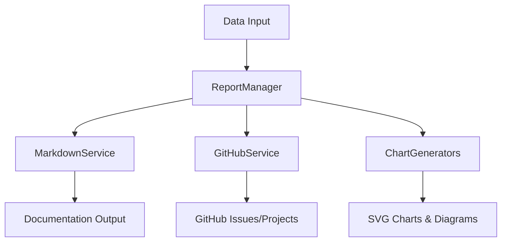

# Library Architecture

The MADE Library (`leds-tools-made-lib`) is the core processing engine that handles data transformation, documentation generation, and GitHub integration.

## Architecture Overview



## Core Components

### 1. Data Models (`model/models.ts`)

#### Primary Models
```typescript
interface Project {
    id: string;
    name: string;
    description?: string;
    startDate?: string;
    dueDate?: string;
}

interface Issue {
    id: string;
    type: string;
    subtype: string;
    title: string;
    description?: string;
    labels?: string[];
    assignee?: TeamMember;
    dependencies?: string[];
}

interface TimeBox {
    id: string;
    name: string;
    description?: string;
    startDate?: string;
    endDate?: string;
    status?: string;
    sprintItems: SprintItem[];
}
```

### 2. Report Manager (`index.ts`)

#### Main Entry Point
```typescript
export class ReportManager {
    // Generate documentation
    public createReport(dbPath: string): void {
        const markdownService = new MarkdownService(dbPath);
        markdownService.createManagementDocumentation();
    }

    // GitHub ETL (Extract, Transform, Load)
    public async githubETL(token: string, org: string, project: string): Promise<void> {
        GitHubTokenManager.initialize(token);
        const githubService = new GitHubService();
        
        await githubService.ETLProject(org, project);
        await githubService.ETLIssue(org, project);
        await githubService.ETLBacklog(org, project);
        await githubService.ETLTimeBox(org, project);
        await githubService.ETLTeam(org);
    }

    // Push to GitHub
    public async githubPush(/* parameters */): Promise<void> {
        GitHubTokenManager.initialize(token);
        const pushService = new GitHubPushService();
        await pushService.fullPush(org, repo, project, epics, stories, tasks);
    }
}
```

### 3. Markdown Services (`markdown/`)

#### MarkdownService Orchestrator
```typescript
class MarkdownService {
    constructor(private dbPath: string) {}

    createManagementDocumentation(): void {
        this.generateBacklogDocumentation();
        this.generateTimeBoxDocumentation();
        this.generateRoadmapDocumentation();
        this.generateProjectSummary();
    }

    private generateBacklogDocumentation(): void {
        const backlogService = new MarkdownBacklogService(this.dbPath);
        backlogService.generate();
    }
}
```

#### Specialized Services
- **MarkdownBacklogService**: Epic/Story/Task documentation
- **MarkdownTimeBoxService**: Sprint and iteration reports
- **MarkdownRoadmapService**: Milestone and release planning
- **MarkdownTeamService**: Team structure and assignments

### 4. Chart Generation (`chart/`)

#### Chart Generators
```typescript
// Cumulative Flow Diagram
class CumulativeFlowDiagram {
    generate(timeboxes: TimeBox[]): string {
        // Generate SVG chart showing work progress
        return svgContent;
    }
}

// Project Throughput
class ProjectThroughputGenerator {
    generate(issues: Issue[]): string {
        // Generate throughput analysis chart
        return svgContent;
    }
}

// Dependency Analysis
class ProjectDependencyAnalyzer {
    generateMermaidDiagram(issues: Issue[]): string {
        // Generate Mermaid dependency diagram
        return mermaidContent;
    }
}
```

### 5. GitHub Integration (`service/`)

#### GitHubService (Data Extraction)
```typescript
class GitHubService {
    async ETLProject(org: string, projectName: string): Promise<Project> {
        const githubProject = await this.getProjectByTitle(org, projectName);
        const project = await this.mapGitHubProjectToProject(githubProject);
        
        // Save to local data store
        FileSystemRepository.save('project.json', project);
        return project;
    }

    async ETLIssue(org: string, projectName: string): Promise<Issue[]> {
        // Extract issues from GitHub
        // Transform to internal format
        // Load into local storage
    }
}
```

#### GitHubPushService (Data Publishing)
```typescript
class GitHubPushService {
    async fullPush(
        org: string,
        repo: string,
        project: Project,
        epics: Issue[],
        stories: Issue[],
        tasks: Issue[]
    ): Promise<void> {
        const projectId = await this.pushProject(org, project);
        
        for (const epic of epics) {
            await this.pushIssue(org, repo, projectId, epic);
        }
        // ... push stories and tasks
    }

    private async pushProject(org: string, project: Project): Promise<string> {
        const mutation = `
            mutation CreateProject($input: CreateProjectV2Input!) {
                createProjectV2(input: $input) {
                    projectV2 { id }
                }
            }
        `;
        
        return await this.graphqlRequest(mutation, variables);
    }
}
```

## Data Flow

### 1. **Input Processing**
```typescript
// From MADE Tool or direct usage
const project: Project = { /* project data */ };
const issues: Issue[] = [ /* issues data */ ];
```

### 2. **Documentation Generation**
```typescript
// Create comprehensive documentation
const markdownService = new MarkdownService('./data');
markdownService.createManagementDocumentation();

// Output:
// - 01_project_overview.md
// - 02_backlogs.md  
// - 03_sprints.md
// - 04_roadmap.md
// - charts/dependencies.svg
```

### 3. **GitHub Integration**
```typescript
// Push to GitHub
await reportManager.githubPush(token, org, repo, project, epics, stories, tasks);

// Creates:
// - GitHub Issues for each Epic/Story/Task
// - GitHub Project with proper structure
// - Milestones for roadmap items
// - Team assignments and labels
```

## Key Features

### Repository Pattern
```typescript
interface Repository<T> {
    save(filename: string, data: T): void;
    load(filename: string): T;
    exists(filename: string): boolean;
}

class FileSystemRepository<T> implements Repository<T> {
    // File-based data persistence
}
```

### Dependency Analysis
```typescript
class DependencyGraph {
    addNode(id: string, dependencies: string[]): void;
    detectCycles(): string[][];
    getTopologicalOrder(): string[];
}
```

### Chart Generation Pipeline
1. **Data Extraction**: Pull relevant metrics from data models
2. **Processing**: Calculate charts data points
3. **Rendering**: Generate SVG or Mermaid output
4. **Integration**: Embed in markdown documentation

## Extension Points

### Custom Chart Generators
```typescript
class CustomChartGenerator extends BaseChartGenerator {
    generate(data: any[]): string {
        // Custom chart logic
        return svgContent;
    }
}
```

### Custom Markdown Services
```typescript
class CustomMarkdownService {
    constructor(private dbPath: string) {}
    
    generateCustomReport(): void {
        // Custom documentation logic
    }
}
```

This architecture provides a robust foundation for data processing while maintaining extensibility for custom requirements.