# Artifact Map

This document maps the relationships between MADE components and their generated artifacts across different output formats.

## Input → Output Mapping

### 1. Documentation Generation

#### From Project Component
```made
project myproject {
    name: "My Project"
    description: "Project description"
    startDate: 2024-01-01
    dueDate: 2024-12-31
}
```

**Generates:**
- `01_overview.md` - Project metadata, metrics, and forecast
- Includes consolidated sprint metrics table
- Project completion probability analysis
- Cumulative Flow Diagram (SVG)

#### From Team Component
```made
team developers {
    name: "Development Team"
    teammember john {
        name: "John Doe"
        email: "john@company.com"
    }
}
```

**Generates:**
- Team data in `data/db/team.json`
- Team assignments in sprint documentation
- Team member information integrated in sprint reports

#### From Backlog Component
```made
backlog productbacklog {
    epic authentication {
        story login {
            task loginform { /* ... */ }
        }
    }
}
```

**Generates:**
- `02_backlogs.md` - Main backlog documentation (may be empty if no standalone backlogs)
- `data/db/backlog.json` - Structured backlog data
- `data/db/issue.json` - All issues (epics, stories, tasks) with dependencies
- Dependency analysis in sprint documentation

#### From Sprint Component
```made
sprint sprint1 {
    sprintbacklog items {
        item productbacklog.authentication.login.loginform {
            assignee: developers.john
            status: TODO
        }
    }
}
```

**Generates:**
- `sprints/{sprint-name}.md` - Individual sprint reports with:
  - Sprint backlog table with assignees and status
  - Gantt chart (Mermaid)
  - Dependency analysis with visual graph
  - Sprint forecast and probability analysis
  - Cumulative Flow Diagram
  - Throughput chart
- `data/db/timebox.json` - Structured sprint data

#### From Roadmap Component
```made
roadmap projectroadmap {
    milestone v1 {
        release alpha {
            item: productbacklog.authentication
        }
    }
}
```

**Generates:**
- `03_roadmap.md` - Roadmap documentation with:
  - Progress overview with milestone statistics
  - Milestone details with releases and associated issues
  - Timeline view of milestones and releases
- `data/db/roadmap.json` - Structured roadmap data

### 2. GitHub Integration

#### Issues Creation
| MADE Component | GitHub Artifact |
|----------------|------------------|
| Epic | GitHub Issue with "Epic" label |
| Story | GitHub Issue with "Story" label |
| Task | GitHub Issue with "Task" label |

#### Project Structure
| MADE Component | GitHub Artifact |
|----------------|------------------|
| Project | GitHub Project V2 |
| Sprint | GitHub Milestone |
| Team | GitHub Team (if org permissions) |

#### Relationships
| MADE Relationship | GitHub Implementation |
|-------------------|----------------------|
| Task dependencies | Issue references in description |
| Sprint assignments | Issue assignee + milestone |
| Epic → Story → Task | Parent-child issue linking |

### 3. Chart Generation

#### Dependency Charts
**Input:** Task dependencies from backlogs
```made
task authentication {
    depends: productbacklog.authentication.login.loginform
}
```

**Output:** Mermaid dependency graphs embedded in sprint documentation

```mermaid
graph BT
    classDef sprint fill:#a8e6cf,stroke:#333,stroke-width:2px;
    classDef external fill:#ffd3b6,stroke:#333,stroke-width:1px;
    loginform["📝 Tarefa: loginform<br>👤 Responsável: John"]:::sprint
    authentication["📝 Tarefa: authentication<br>👤 Responsável: Jane"]:::sprint
    authentication -.-> loginform
```


#### Sprint Forecast Charts
**Input:** Sprint items with status and completion data
```made
item productbacklog.task {
    status: DONE
    completedDate: 2024-02-10
}
```

**Output:** Embedded SVG charts in sprint documentation:
- `charts/cfd-{sprint-name}.svg` - Cumulative Flow Diagram
- `charts/throughput-{sprint-name}.svg` - Throughput analysis

#### Project-level Charts
**Input:** All sprint data across the project
**Output:** 
- `project-cfd.svg` - Overall project Cumulative Flow Diagram

## File Structure Output

### Complete Generation Result
```
project/
├── 01_overview.md              # Project overview with metrics and forecast
├── 02_backlogs.md             # Backlog documentation (may be minimal)
├── 03_roadmap.md              # Roadmap with milestones and releases
├── _category_.json            # Navigation configuration
├── project-cfd.svg            # Project-level cumulative flow diagram
├── sprints/
│   ├── _category_.json        # Sprint section navigation
│   ├── sprint1.md             # Individual sprint reports with:
│   ├── sprint2.md             #   - Backlog tables
│   └── charts/                #   - Dependency analysis
│       ├── cfd-sprint1.svg    #   - Gantt charts
│       ├── throughput-sprint1.svg  #   - Forecast analysis
│       └── cfd-sprint2.svg    #   - Charts and metrics
└── data/
    └── db/
        ├── project.json       # Project metadata
        ├── issue.json         # All issues with hierarchy and dependencies
        ├── backlog.json       # Backlog structures
        ├── timebox.json       # Sprint data with items and assignments
        ├── roadmap.json       # Roadmap with milestones and releases
        ├── team.json          # Team and member information
        └── process.json       # Process definitions
```

## Data Flow Mapping

### 1. AST → Domain Models
```typescript
// From parsed .made file
Model → {
  Project,
  Team[],
  Backlog[],
  TimeBox[],
  Roadmap[]
}
```

### 2. Domain Models → Output Artifacts
```typescript
Project → {
  "01_overview.md",           // Project metrics and forecast
  "project-cfd.svg",          // Project-level cumulative flow
  "data/db/project.json"
}

Backlog[] → {
  "02_backlogs.md",           // Backlog documentation (may be minimal)
  "data/db/backlog.json",     // Structured backlog data
  "data/db/issue.json"        // Issues with dependencies
}

TimeBox[] → {
  "sprints/{sprint-name}.md", // Individual sprint reports with analysis
  "charts/cfd-{sprint}.svg",  // Sprint cumulative flow diagrams
  "charts/throughput-{sprint}.svg", // Sprint throughput charts
  "data/db/timebox.json"      // Sprint data with assignments
}

Roadmap[] → {
  "03_roadmap.md",            // Roadmap with milestones and timeline
  "data/db/roadmap.json"      // Structured roadmap data
}

Team[] → {
  "data/db/team.json"         // Team and member data
}

Process[] → {
  "data/db/process.json"      // Process definitions
}
```

### 3. GitHub Push Mapping
```typescript
Project → GitHub Project V2
Issue[] → GitHub Issues
TimeBox[] → GitHub Milestones
Team[] → GitHub Teams (optional)
```

## Customization Points

### Custom Chart Types
```typescript
// Add new chart generator
class CustomChartGenerator {
  generate(data: BacklogData): string {
    // Return SVG or Mermaid content
  }
}
```

### Custom Documentation Sections
```typescript
// Add new markdown service
class CustomMarkdownService {
  generateCustomSection(data: ProjectData): string {
    // Return markdown content
  }
}
```

### Custom GitHub Integration
```typescript
// Extend GitHub push service
class CustomGitHubPushService extends GitHubPushService {
  async pushCustomArtifacts(data: CustomData): Promise<void> {
    // Custom GitHub integration logic
  }
}
```

## Template System

### Markdown Templates
Templates use Handlebars-like syntax for dynamic content:

```markdown
# {{project.name}}

**Description:** {{project.description}}
**Duration:** {{project.startDate}} to {{project.dueDate}}

## Team Members
{{#each teams}}
### {{name}}
{{#each teamMembers}}
- **{{name}}** ({{email}})
{{/each}}
{{/each}}
```

### Chart Templates
SVG charts use data-driven generation:

```typescript
const chartData = {
  title: sprint.name,
  data: sprintItems.map(item => ({
    date: item.completedDate,
    remaining: calculateRemaining(item)
  }))
};

const svg = generateBurndownChart(chartData);
```

This artifact mapping provides a comprehensive view of how MADE transforms input definitions into various output formats, enabling both documentation and project management workflows.