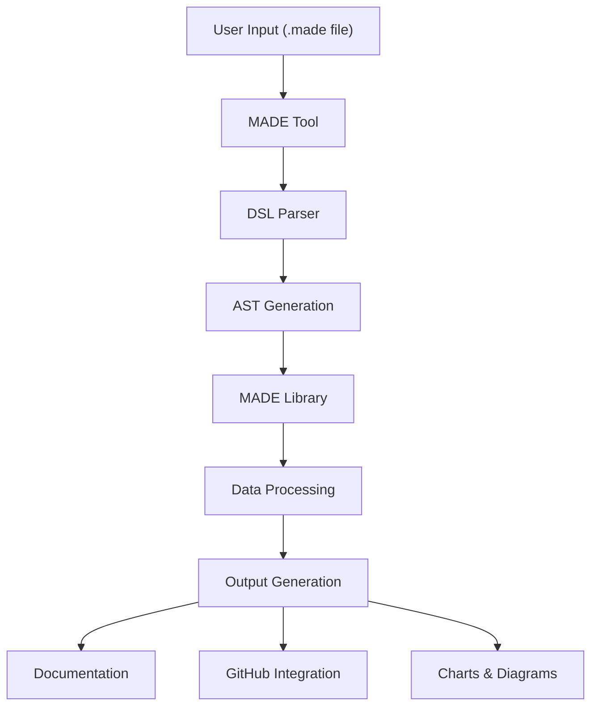

# Understanding MADE's Architecture: Tool vs Library

**Ready to dig deeper?** This page explains how MADE is built internally — perfect for developers who want to contribute, extend MADE, or integrate it into their own projects.

## Why This Matters

**For Contributors**: Understanding the architecture helps you know where to make changes  
**For Integrators**: Learn how to use MADE's library in your own applications  
**For Curious Users**: See how the magic happens behind the scenes

**Key insight**: MADE is split into two distinct parts that work together but can also work independently.

---

## The Big Picture: Two-Part Architecture

Think of MADE like a restaurant:
- **The Tool** (VS Code extension + CLI) = The friendly waiter who takes your order
- **The Library** (processing engine) = The skilled chef who prepares your meal

This separation means you can:
✅ Use the library directly in your own applications  
✅ Create new user interfaces that connect to the same engine  
✅ Test and develop each part independently

---

## Part 1: MADE Tool (`leds-tools-made`)

**What it is**: The user-facing parts — VS Code extension and CLI command

### What the Tool Does for You
🎯 **Understands your `.made` files**: Parses the DSL syntax and checks for errors  
🎨 **Provides a friendly interface**: Syntax highlighting, autocomplete, right-click menus  
⚡ **Handles commands**: When you click "Generate Documentation", the tool coordinates everything  
🔗 **Connects the pieces**: Takes your input and passes it to the processing library

### Tool Architecture (For Developers)

```
📁 leds-tools-made/
├── 📁 application/      ← Domain logic (Project, Team, TimeBox classes)
├── 📁 language/         ← Langium grammar files (.made syntax rules)
├── 📁 static/           ← VS Code editor UI components  
├── 📁 cli/              ← Command-line interface code
└── 📁 extension/        ← VS Code extension hooks and commands
```

**Key technologies**:
- **Langium**: Creates the `.made` language and provides intelligent editing
- **VS Code Extension API**: Integrates with your editor
- **Node.js**: Powers the CLI and background processing

**Developer tip**: If you want to add new DSL syntax or VS Code features, you'll work in this repository.

---

## Part 2: MADE Library (`leds-tools-made-lib`)

**What it is**: The processing engine that does the heavy lifting

### What the Library Does for You
⚙️ **Processes your data**: Transforms `.made` content into useful structures  
📋 **Generates documentation**: Creates beautiful Markdown reports with charts  
📊 **Creates visualizations**: SVG charts, dependency graphs, timelines  
🔗 **Handles GitHub integration**: Creates issues, projects, and milestones automatically

### Library Architecture (For Developers)

```
📁 leds-tools-made-lib/
├── 📁 models/           ← Data structures (Project, Sprint, Issue types)
├── 📁 markdown/         ← Report generation services
├── 📁 chart/           ← SVG chart creators (burndown, CFD, dependencies)
├── 📁 util/            ← Helper functions and utilities
└── 📁 service/         ← GitHub API integration logic
```

**Key services explained**:
- **MarkdownService**: The "report writer" that creates your documentation
- **GitHubService**: The "GitHub connector" that creates issues and projects  
- **ChartGenerators**: The "visualization artists" that create graphs and diagrams
- **DependencyAnalyzer**: The "relationship mapper" that figures out task dependencies

**Developer tip**: If you want to add new output formats or integrations, you'll work in this repository.

---

## Why Split Into Two Parts?

### 🧩 **Modularity** (Easier to Understand)
- **Tool**: "How do users interact with MADE?"
- **Library**: "How does MADE process and generate outputs?"
- Each part has a clear, focused purpose

### 🔄 **Reusability** (Use MADE Your Way)
- Use the library directly in Node.js applications
- Create web interfaces, mobile apps, or other frontends
- Integrate MADE into existing CI/CD pipelines

### 🛠️ **Maintainability** (Easier to Develop)
- Test user interface separately from processing logic
- Clear API boundaries prevent tangled code
- Different teams can work on different parts

### 🚀 **Extensibility** (Future-Proof)
- Add new user interfaces without changing the core
- Extend processing capabilities independently
- Support plugin architectures

## Integration Flow



## Usage Patterns

### Direct Library Usage
```typescript
import { ReportManager } from 'made-lib-beta';

const reportManager = new ReportManager();
await reportManager.githubPush(token, org, repo, project, epics, stories, tasks);
```

### Tool-mediated Usage
```bash
# Via CLI
npx made-cli github project.made

# Via VS Code Extension
# Right-click > Generate GitHub Issues
```

This architecture allows MADE to be both user-friendly through the tool interface and powerful through direct library integration.