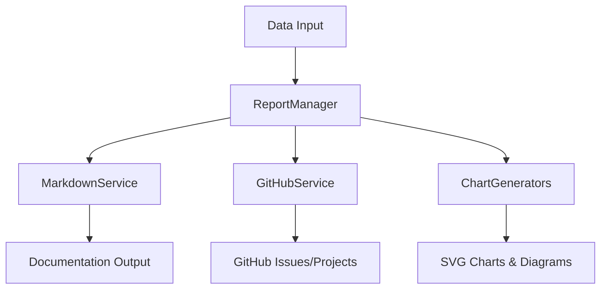

# Library Architecture

> 🔧 **For Contributors**: Ready to dive into MADE's processing engine? This guide shows you how the library transforms your project data into beautiful documentation and GitHub integrations!

## 🎯 What You'll Learn

By the end of this page, you'll understand:
- How MADE's library turns raw data into useful outputs
- The role of each service in the processing pipeline
- How to add your own renderers and integrations
- Best practices for extending the library

## 🚀 Why Library Architecture Matters

Think of MADE's library like a **professional kitchen** 👨‍🍳:
- **Raw Ingredients (your data)** come in from the tool
- **Specialized Chefs (services)** each handle their expertise
- **Kitchen Equipment (generators)** create the final presentations
- **Serving Staff (integrations)** deliver results to the right places

This separation means:
- ✅ **Reusable**: Use the library in any JavaScript/TypeScript project
- ✅ **Testable**: Each service can be tested independently
- ✅ **Extensible**: Add new outputs without changing existing code
- ✅ **Maintainable**: Clear responsibilities for each component

---

## 🔧 Technical Foundation

The MADE Library (`leds-tools-made-lib`) is the core processing engine that handles data transformation, documentation generation, and GitHub integration. It's designed to be used by the MADE Tool, but can also be used directly in your own projects!

## 📊 Architecture Overview

Here's how the library processes your data:



### 🎭 The Processing Pipeline

1. **Data Input** 📥 - Your project data (from tool or direct usage)
2. **ReportManager** 🎪 - The central coordinator that orchestrates everything
3. **MarkdownService** 📝 - Creates beautiful documentation files
4. **GitHubService** 🚀 - Handles GitHub API integrations
5. **ChartGenerators** 📊 - Creates visual charts and diagrams
6. **Outputs** ✨ - Documentation, GitHub issues, and visual charts

> 💡 **Key Insight**: Each component has a single responsibility and can be used independently or together!

---

## 🏗️ Core Components

### 1. Data Models (`model/models.ts`) 📋

**What it does**: Defines the structure of all data flowing through the library

Think of these as **blueprints** that ensure everyone speaks the same language.

#### Primary Models - The Core Data Types

```typescript
// 🏢 Your Project Information
interface Project {
    id: string;           // Unique identifier
    name: string;         // Project name
    description?: string; // What's this project about?
    startDate?: string;   // When it begins
    dueDate?: string;     // When it should finish
}

// 📋 Work Items (Epics, Stories, Tasks)
interface Issue {
    id: string;              // Unique identifier
    type: string;            // "epic", "story", "task"
    subtype: string;         // More specific classification
    title: string;           // What needs to be done
    description?: string;    // Detailed requirements
    labels?: string[];       // Tags for organization
    assignee?: TeamMember;   // Who's responsible
    dependencies?: string[]; // What must be done first
}

// 📅 Time Periods (Sprints, Iterations)
interface TimeBox {
    id: string;              // Unique identifier
    name: string;            // Sprint name (e.g., "Sprint 1")
    description?: string;    // Sprint goals
    startDate?: string;      // When sprint starts
    endDate?: string;        // When sprint ends
    status?: string;         // "planned", "active", "completed"
    sprintItems: SprintItem[]; // What work is included
}
```

> 🎯 **Why TypeScript interfaces?** They provide **type safety** - if you try to put a number where a string should go, TypeScript catches it immediately!

---

### 2. Report Manager (`index.ts`) 🎪

**What it does**: The central coordinator that orchestrates all processing

Think of this as the **project manager** that delegates tasks to the right specialists.

#### Main Entry Points
```typescript
export class ReportManager {
    // 📄 Generate comprehensive documentation
    public createReport(dbPath: string): void {
        const markdownService = new MarkdownService(dbPath);
        markdownService.createManagementDocumentation();
    }

    // 📥 Extract data FROM GitHub (GitHub → MADE)
    public async githubETL(token: string, org: string, project: string): Promise<void> {
        GitHubTokenManager.initialize(token);
        const githubService = new GitHubService();
        
        await githubService.ETLProject(org, project);    // Get project info
        await githubService.ETLIssue(org, project);      // Get all issues
        await githubService.ETLBacklog(org, project);    // Get backlog items
        await githubService.ETLTimeBox(org, project);    // Get sprint info
        await githubService.ETLTeam(org);                // Get team members
    }

    // 🚀 Push data TO GitHub (MADE → GitHub)
    public async githubPush(/* parameters */): Promise<void> {
        GitHubTokenManager.initialize(token);
        const pushService = new GitHubPushService();
        await pushService.fullPush(org, repo, project, epics, stories, tasks);
    }
}
```

#### Usage Examples
```typescript
// 📄 Generate documentation only
const reportManager = new ReportManager();
reportManager.createReport('./project-data');

// 🔄 Two-way GitHub sync
await reportManager.githubETL(token, 'myorg', 'myproject');  // GitHub → Local
await reportManager.githubPush(token, 'myorg', 'myrepo', projectData); // Local → GitHub
```

> 💡 **ETL stands for**: Extract (get data), Transform (convert format), Load (save locally). It's like downloading, translating, and storing GitHub data!

---

### 3. Markdown Services (`markdown/`) 📝

**What it does**: Transforms your data into beautiful, readable documentation

Think of these as **technical writers** that know exactly how to present different types of information.

#### MarkdownService - The Documentation Orchestrator
```typescript
class MarkdownService {
    constructor(private dbPath: string) {}

    createManagementDocumentation(): void {
        this.generateBacklogDocumentation();    // 📋 Epic/Story/Task docs
        this.generateTimeBoxDocumentation();    // 📅 Sprint reports
        this.generateRoadmapDocumentation();    // 🗺️ Milestone planning
        this.generateProjectSummary();         // 📊 Overall overview
    }

    private generateBacklogDocumentation(): void {
        const backlogService = new MarkdownBacklogService(this.dbPath);
        backlogService.generate(); // Creates detailed backlog documentation
    }
}
```

#### Specialized Documentation Services

| Service | What It Creates | Perfect For |
|---------|----------------|-------------|
| **MarkdownBacklogService** | Epic/Story/Task documentation | 📋 Understanding work breakdown |
| **MarkdownTimeBoxService** | Sprint and iteration reports | 📅 Tracking progress over time |
| **MarkdownRoadmapService** | Milestone and release planning | 🗺️ Long-term planning |
| **MarkdownTeamService** | Team structure and assignments | 👥 Understanding who does what |

> 🎯 **Output Example**: These services create files like `01_project_overview.md`, `02_backlogs.md`, `03_sprints.md` with professional formatting and charts!

---

### 4. Chart Generation (`chart/`) 📊

**What it does**: Creates visual representations of your project data

Think of these as **data visualization specialists** that turn numbers into insights.

#### Chart Generator Examples
```typescript
// 📈 Cumulative Flow Diagram - Shows work flow over time
class CumulativeFlowDiagram {
    generate(timeboxes: TimeBox[]): string {
        // Analyzes sprint data to show work progress trends
        return svgContent; // Returns ready-to-use SVG chart
    }
}

// ⚡ Project Throughput - Shows team velocity
class ProjectThroughputGenerator {
    generate(issues: Issue[]): string {
        // Calculates how fast work is completed
        return svgContent; // Shows velocity trends
    }
}

// 🕸️ Dependency Analysis - Shows task relationships
class ProjectDependencyAnalyzer {
    generateMermaidDiagram(issues: Issue[]): string {
        // Maps out which tasks depend on others
        return mermaidContent; // Creates dependency graph
    }
}
```

#### Available Chart Types

| Chart Type | What It Shows | When To Use |
|------------|---------------|-------------|
| **Cumulative Flow** | Work progress over time | 📈 Understanding workflow health |
| **Throughput** | Team velocity trends | ⚡ Measuring team performance |
| **Dependencies** | Task relationships | 🕸️ Managing complex projects |
| **Burndown** | Remaining work in sprint | 🔥 Sprint progress tracking |

> 💡 **Pro Tip**: Charts are generated as SVG (scalable graphics) or Mermaid diagrams, so they look crisp at any size and work great in documentation!

---

### 5. GitHub Integration (`service/`) 🚀

**What it does**: Handles all communication with GitHub's API

Think of these as **API specialists** that know how to speak GitHub's language fluently.

#### GitHubService - Data Extraction (GitHub → MADE)
```typescript
class GitHubService {
    // 📥 Extract project information from GitHub
    async ETLProject(org: string, projectName: string): Promise<Project> {
        const githubProject = await this.getProjectByTitle(org, projectName);
        const project = await this.mapGitHubProjectToProject(githubProject);
        
        // Save locally for processing
        FileSystemRepository.save('project.json', project);
        return project;
    }

    // 📥 Extract all issues from GitHub repository
    async ETLIssue(org: string, projectName: string): Promise<Issue[]> {
        // Gets issues, converts to MADE format, saves locally
    }
}
```

#### GitHubPushService - Data Publishing (MADE → GitHub)
```typescript
class GitHubPushService {
    async fullPush(
        org: string,
        repo: string,
        project: Project,
        epics: Issue[],
        stories: Issue[],
        tasks: Issue[]
    ): Promise<void> {
        // 1. Create GitHub project
        const projectId = await this.pushProject(org, project);
        
        // 2. Create issues for each work item
        for (const epic of epics) {
            await this.pushIssue(org, repo, projectId, epic);
        }
        // ... creates stories and tasks too
    }

    private async pushProject(org: string, project: Project): Promise<string> {
        // Uses GraphQL mutation to create GitHub project
        const mutation = `
            mutation CreateProject($input: CreateProjectV2Input!) {
                createProjectV2(input: $input) {
                    projectV2 { id }
                }
            }
        `;
        
        return await this.graphqlRequest(mutation, variables);
    }
}
```

#### GitHub Integration Capabilities

| Direction | What Happens | Use Case |
|-----------|--------------|----------|
| **GitHub → MADE** | Import existing projects | 📥 Starting with existing data |
| **MADE → GitHub** | Create issues and projects | 🚀 Setting up new projects |
| **Bi-directional** | Keep everything in sync | 🔄 Ongoing project management |

> 🔑 **Authentication**: Uses GitHub tokens for secure API access. The library handles all the complex GraphQL queries and REST API calls for you!

---
## 🔄 Data Flow: From Input to Output

Here's the **complete journey** your data takes through the library:

### Step 1: **Input Processing** 📥
```typescript
// Data comes from MADE Tool or direct library usage
const project: Project = { 
    id: "proj-1", 
    name: "My Awesome Project", 
    description: "Building the next big thing" 
};
const issues: Issue[] = [
    { id: "epic-1", type: "epic", title: "User Authentication", /* ... */ }
];
```
**What happens**: Raw project data enters the system in a standardized format.

### Step 2: **Documentation Generation** 📝
```typescript
// Create comprehensive, professional documentation
const markdownService = new MarkdownService('./data');
markdownService.createManagementDocumentation();

// 📄 Output files created:
// ├── 01_project_overview.md     (Executive summary)
// ├── 02_backlogs.md            (Detailed work breakdown)
// ├── 03_sprints.md             (Sprint planning & progress)
// ├── 04_roadmap.md             (Long-term milestones)
// └── charts/
//     ├── dependencies.svg       (Task dependency graph)
//     ├── throughput.svg         (Team velocity chart)
//     └── burndown.svg          (Sprint progress chart)
```

### Step 3: **GitHub Integration** 🚀
```typescript
// Push everything to GitHub for team collaboration
await reportManager.githubPush(token, org, repo, project, epics, stories, tasks);

// 🚀 GitHub artifacts created:
// ├── GitHub Issues (one per Epic/Story/Task)
// ├── GitHub Project (with proper columns and views)  
// ├── Milestones (for roadmap items)
// ├── Labels (for categorization)
// └── Assignments (team members linked to work)
```

> 🎯 **The Magic**: Your simple `.made` file becomes a complete project management setup with documentation, visual charts, and GitHub integration!

---

## 🛠️ Key Features & Patterns

### Repository Pattern 📁
**What it does**: Provides a clean interface for data storage and retrieval

```typescript
// Abstract interface that any storage can implement
interface Repository<T> {
    save(filename: string, data: T): void;    // Store data
    load(filename: string): T;                // Retrieve data
    exists(filename: string): boolean;        // Check if data exists
}

// File-based implementation (default)
class FileSystemRepository<T> implements Repository<T> {
    save(filename: string, data: T): void {
        // Saves to JSON files on disk
        fs.writeFileSync(filename, JSON.stringify(data, null, 2));
    }
    
    load(filename: string): T {
        // Loads and parses JSON files
        return JSON.parse(fs.readFileSync(filename, 'utf8'));
    }
}
```

**Why this pattern?** 
- ✅ **Flexible**: Easy to switch from files to databases later
- ✅ **Testable**: Mock repository for unit tests
- ✅ **Consistent**: Same interface for all data operations

### Dependency Analysis 🕸️
**What it does**: Analyzes task relationships and detects problems

```typescript
class DependencyGraph {
    addNode(id: string, dependencies: string[]): void {
        // Builds graph of task relationships
    }
    
    detectCycles(): string[][] {
        // Finds circular dependencies (A depends on B, B depends on A)
        // Returns: [["task-1", "task-2", "task-1"]] for cycles found
    }
    
    getTopologicalOrder(): string[] {
        // Returns tasks in order they should be completed
        // Example: ["foundation", "walls", "roof"]
    }
}
```

**Real-world benefits**:
- 🚨 **Prevents deadlocks**: Detects when Task A needs Task B, but Task B needs Task A
- 📋 **Smart ordering**: Suggests the optimal order to complete tasks
- 🎯 **Risk identification**: Highlights tasks that block many others

### Chart Generation Pipeline 📊
**How charts are created**:

1. **Data Extraction** 📥
   ```typescript
   const completedTasks = issues.filter(i => i.status === 'completed');
   const sprintVelocity = calculateVelocity(completedTasks, timeboxes);
   ```

2. **Processing** ⚙️
   ```typescript
   const chartData = sprintVelocity.map(sprint => ({
       date: sprint.endDate,
       velocity: sprint.completedPoints
   }));
   ```

3. **Rendering** 🎨
   ```typescript
   const svgChart = generateVelocityChart(chartData);
   // Creates professional SVG charts
   ```

4. **Integration** 📝
   ```typescript
   const markdown = `## Team Velocity\n\n${svgChart}\n\nOur team completed...`;
   // Embeds charts directly in documentation
   ```

---

## 🚀 Extension Points: Adding Your Own Features

Want to extend the library? Here are the **main extension points**:

### Custom Chart Generators 📊

**When to use**: You want to visualize data in a new way

```typescript
class CustomChartGenerator extends BaseChartGenerator {
    generate(data: any[]): string {
        // Example: Generate team workload distribution chart
        const workloadData = this.calculateWorkload(data);
        const svgContent = this.renderWorkloadChart(workloadData);
        return svgContent;
    }
    
    private calculateWorkload(issues: Issue[]): WorkloadData[] {
        // Your custom calculation logic
        return issues.reduce((acc, issue) => {
            // Group by assignee, calculate story points, etc.
        }, []);
    }
}
```

**Steps to add**:
1. Extend `BaseChartGenerator`
2. Implement your `generate()` method
3. Register with `ChartGeneratorRegistry`
4. Use in markdown services

### Custom Markdown Services 📝

**When to use**: You want new types of documentation

```typescript
class CustomMarkdownService {
    constructor(private dbPath: string) {}
    
    generateCustomReport(): void {
        const data = this.loadProjectData();
        const customContent = this.processCustomLogic(data);
        
        // Example: Generate compliance report
        const complianceReport = `
# Compliance Report

## Security Requirements
${this.generateSecuritySection(data)}

## Quality Gates
${this.generateQualitySection(data)}
        `;
        
        this.saveReport('compliance_report.md', complianceReport);
    }
}
```

### Custom GitHub Integrations 🚀

**When to use**: You want to integrate with other tools via GitHub

```typescript
class CustomGitHubIntegration extends GitHubService {
    async pushToCustomTool(issues: Issue[]): Promise<void> {
        // Example: Create Slack notifications for new issues
        for (const issue of issues) {
            if (issue.type === 'epic') {
                await this.notifySlack(`New epic created: ${issue.title}`);
            }
        }
    }
    
    async syncWithJira(issues: Issue[]): Promise<void> {
        // Example: Keep Jira tickets in sync with GitHub issues
        // Your custom integration logic here
    }
}
```

### Common Extension Scenarios 🎯

| Want to Add... | Extend... | Example Use Case |
|----------------|-----------|------------------|
| **New chart type** | `BaseChartGenerator` | Risk heat maps, Cost analysis |
| **New documentation** | `MarkdownService` | Compliance reports, Architecture docs |
| **New output format** | `ReportManager` | PDF exports, Excel reports |
| **New integrations** | `GitHubService` | Slack notifications, Jira sync |
| **New data sources** | `Repository` | Database storage, API imports |

---

## 🎓 Best Practices for Library Development

### Code Organization 📁
```
lib/
├── model/          # 📋 Data definitions
├── service/        # 🚀 External integrations  
├── markdown/       # 📝 Documentation generators
├── chart/          # 📊 Visualization generators
├── repository/     # 💾 Data persistence
└── utils/          # 🛠️ Helper functions
```

### Testing Strategy 🧪
```typescript
// Unit tests for each service
describe('MarkdownBacklogService', () => {
    it('should generate backlog documentation', () => {
        const service = new MarkdownBacklogService('./test-data');
        const result = service.generate();
        expect(result).toContain('# Backlog Overview');
    });
});

// Integration tests for full workflows
describe('ReportManager Integration', () => {
    it('should create complete project documentation', async () => {
        const manager = new ReportManager();
        await manager.createReport('./test-project');
        
        // Verify all expected files are created
        expect(fs.existsSync('01_project_overview.md')).toBe(true);
        expect(fs.existsSync('charts/dependencies.svg')).toBe(true);
    });
});
```

### Performance Considerations ⚡
- ✅ **Lazy Loading**: Only load data when needed
- ✅ **Caching**: Cache expensive calculations
- ✅ **Streaming**: Process large datasets incrementally
- ✅ **Parallel Processing**: Generate charts and docs simultaneously

### Error Handling 🛡️
```typescript
class RobustService {
    async processData(data: ProjectData): Promise<Result> {
        try {
            const validated = this.validateInput(data);
            const processed = await this.transform(validated);
            return { success: true, data: processed };
        } catch (error) {
            logger.error('Processing failed', { error, data });
            return { success: false, error: error.message };
        }
    }
}
```

---

## 🎯 Next Steps for Contributors

### Getting Started
1. **📚 Study existing services** to understand patterns
2. **🧪 Write tests first** for any new functionality
3. **📖 Check TypeScript interfaces** for data contracts
4. **🔍 Use the repository pattern** for data access

### Development Workflow
1. **Fork and clone** the library repository
2. **Create feature branch** for your enhancement
3. **Add tests** that cover your new functionality
4. **Update documentation** with usage examples
5. **Submit pull request** with clear description

This architecture provides a robust foundation for data processing while maintaining extensibility for custom requirements. The modular design means you can enhance specific areas without affecting the whole system! 🏗️