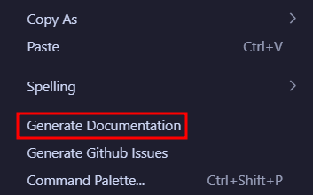
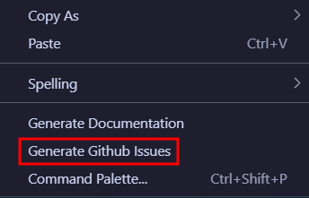

# How to Use MADE in VS Code

## Installation

### Method 1: VS Code Marketplace
1. Open Visual Studio Code
2. Go to Extensions (Ctrl+Shift+X)
3. Search for "MADE - Leds - Beta"
4. Click **Install**

### Method 2: Direct Install Link
[Click to Install](vscode:extension/Paulo-Lopes.made-beta)

### Method 3: Manual Installation (VSIX)
1. Download the latest `.vsix` file from releases
2. Open Visual Studio Code
3. Right-click and select "Install Extension VSIX"

## Basic Usage

### 1. Create a .made File
Create a new file with the `.made` extension in your project directory.

### 2. Generate Documentation
1. Right-click on your `.made` file
2. Select **Generate Documentation**
3. Markdown files will be generated in the same directory



### 3. GitHub Integration Setup
Create a `.env` file in the same directory as your `.made` file:

```env
GITHUB_TOKEN=your_github_token
GITHUB_ORG=your_organization
GITHUB_REPO=your_repository
```

### 4. Push to GitHub
1. Right-click on your `.made` file
2. Select **Generate Github Issues**
3. Issues and project structure will be created in GitHub



## Features

- **Syntax Highlighting**: Full syntax support for `.made` files
- **Auto-completion**: IntelliSense for MADE DSL
- **Error Detection**: Real-time validation and error reporting
- **Right-click Actions**: Easy access to generation commands
- **Environment Integration**: Automatic `.env` file detection

## Troubleshooting

### Common Issues
- **Missing .env file**: Ensure GitHub credentials are properly configured
- **Permission errors**: Verify GitHub token has necessary permissions
- **Syntax errors**: Check the .made file for proper DSL syntax

### Required GitHub Token Permissions
- `repo` - Full repository access
- `write:org` - Create teams and manage organization