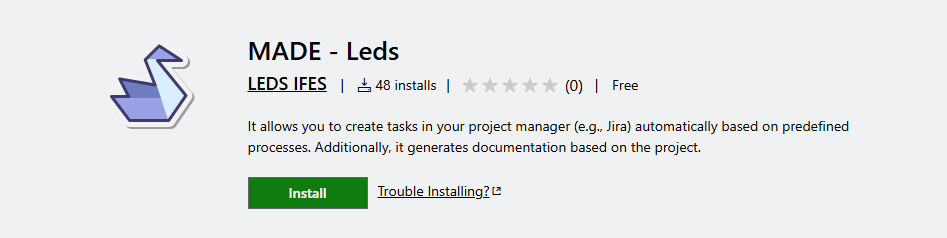

# What is MADE

MADE (Management as a Code) is an innovative plugin that helps Project Management and development teams efficiently create backlogs and sprints. It emphasizes process reuse and standardization, streamlining task management across projects.

## Key Features

- **Process Reuse**: Define processes once, reuse across projects
- **Standardization**: Consistent project management across teams
- **GitHub Integration**: Push directly to GitHub Issues and Projects
- **Documentation Generation**: Auto-generate markdown reports
- **Agile Support**: Built-in support for Epics, Stories, Tasks, and Sprints

## Core Components

MADE uses a Domain-Specific Language (DSL) that consists of:

- **Project**: Configuration and metadata
- **Team**: Team members and organization
- **Backlog**: Epics, Stories, and Tasks
- **TimeBox**: Sprints and iterations
- **Process**: Reusable workflows
- **Roadmap**: Milestones and releases

## How It Works

1. Write your project structure in `.made` files using the DSL
2. Use VS Code extension or CLI to process the files
3. Generate documentation or push to GitHub automatically
4. Maintain consistency across projects with reusable processes

## Benefits

- **Consistency**: Standardized approach to project management
- **Efficiency**: Reduce repetitive setup work
- **Integration**: Seamless GitHub workflow integration
- **Documentation**: Auto-generated, always up-to-date documentation
- **Collaboration**: Clear team structure and responsibility definition