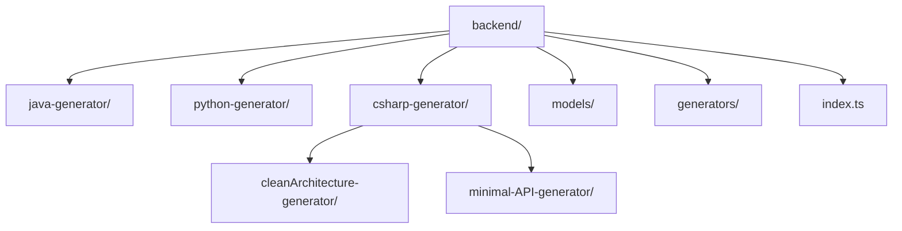
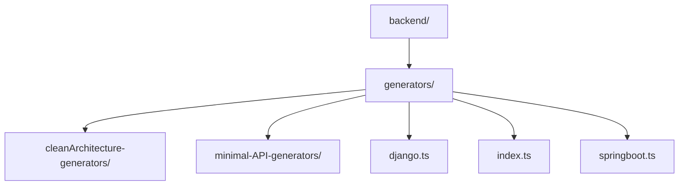
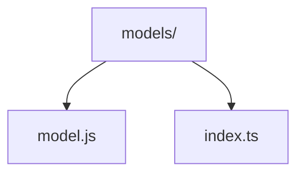
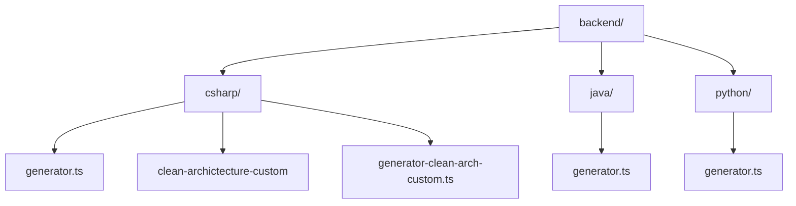

To modularize, we copy the folder structure of the backend generators into our lib, in order to remove this part of the processing from within the main program.

We created this directory structure

We created the generators folder to make the calls uniform and in the same directory, this is necessary npm
The final use of the lib is in referencing these generators folder

The models folder was created due to the common need to use files that were also shared in the application within the original Spark structure.

index.ts is an extremely important part in the construction of our lib, it is where the logic imports are scaled between folders and referenced at the time of import for use in the source code.

---

### Use in Spark

With the use of the lib we needed to modify our source code of the spark generators, where all code generation logic was within the source code, with the use of our lib we removed all this part of the product logic and kept only the lib calls we created, keeping only one generator.ts within each respective language.

This leaves us with the source code structure like this:

These generators are where spark-generators-lib is called for each language, thus communicating with the generators and index within the lib.