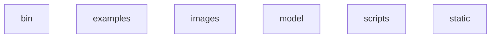
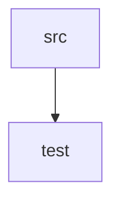

# Overview
## Top Layer

## Bottom Layer

The bottom layers are the most important parts of the project. This is where the real magic happens.

## Src (Source)
The Src folder is automatically generated by a Langium project. It contains the most essential information and definitions of Spark.

## Test
This folder is responsible for maintaining and structuring the Spark tests to ensure the integrity and accuracy of the generated code.