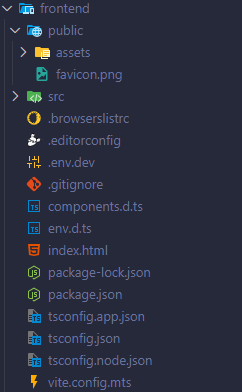
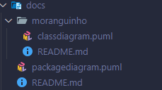

In free translate, Litle Strawbery

# .spark File
```
Configuration {
    software_name: "Morango"
    about: "Moranguinho!"
    language: csharp-clean-architecture
}

module Moranguinho {

    
    entity Agricultor{
        nome: string
        identification: cpf
        email_x: email
        telefone: string
        foto: file
        Agricultor OneToMany Moranguinho.Propriedade
    }

    entity Propriedade {
        nome: string
        distrito: string
    }
    
    
}
```

# Class Diagram


# Output




