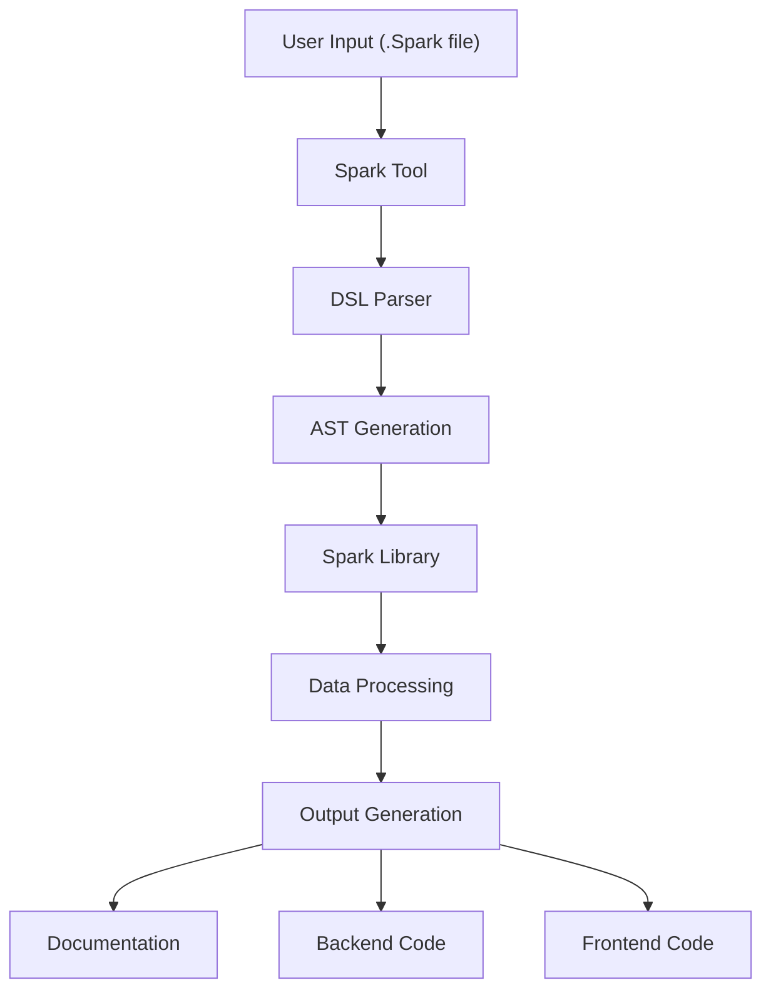

# Tool vs Library Architecture

Spark is split into two main components: the **Tool** and the **Library**. Understanding this separation is crucial for developers who want to extend or integrate Spark.

## Spark Tool (`leds-tools-spark`)

### Purpose
The VS Code extension and CLI interface that provides user interaction and DSL parsing.

### Key Responsibilities
- **DSL Parsing**: Interprets `.Spark` files using Langium grammar
- **User Interface**: VS Code extension with syntax highlighting and commands
- **CLI Interface**: Command-line tool for automation
- **Integration**: Connects user input to the processing library

### Core Components
```
application/       # Domain applications (Project, Team, TimeBox, etc.)
language/          # Langium DSL grammar and parser
static/            # Monaco Editor UI files
cli/               # Command-line interface
extension/         # VS Code extension code
```

### Technologies
- **Langium**: DSL creation and parsing
- **VS Code Extension API**: Editor integration
- **Node.js**: CLI and backend processing
- **TypeScript**: Type-safe development

## Spark Library (`leds-tools-Spark-lib`)

### Purpose
The core processing engine that generates documentation, charts, and handles GitHub integration.

### Key Responsibilities
- **Data Processing**: Transforms parsed DSL into actionable data structures
- **Documentation Generation**: Creates markdown reports and documentation
- **Visualization**: Generates SVG charts and dependency diagrams
- **GitHub Integration**: Pushes data to GitHub Issues and Projects

### Core Components
```
models/            # Data models (Project, Sprint, Issue, etc.)
markdown/          # Documentation generation services
chart/             # SVG chart generators (CFD, throughput, dependencies)
util/              # Common utilities and helpers
service/           # GitHub API integration
```

### Key Services
- **MarkdownService**: Orchestrates documentation generation
- **GitHubService**: Handles GitHub API operations
- **ChartGenerators**: Creates visual diagrams
- **DependencyAnalyzer**: Analyzes task relationships

## Separation Benefits

### 1. **Modularity**
- Tool focuses on user interaction
- Library focuses on data processing
- Clear separation of concerns

### 2. **Reusability**
- Library can be used independently
- Multiple frontends can use the same library
- Different deployment scenarios supported

### 3. **Maintainability**
- Easier to test individual components
- Clear API boundaries
- Independent versioning possible

### 4. **Extensibility**
- New frontends can be added easily
- Library features can be extended independently
- Plugin architecture support

## Integration Flow



## Usage Patterns

### Tool-mediated Usage
```bash
# Via CLI
spark-cli generate path/to/spark/file

# Via VS Code Extension
# Right-click > Generate All
# Right-click > Generate Backend
# Right-click > Generate Frontend
# Right-click > Project Documentation
```

This architecture allows Spark to be both user-friendly through the tool interface and powerful through direct library integration.