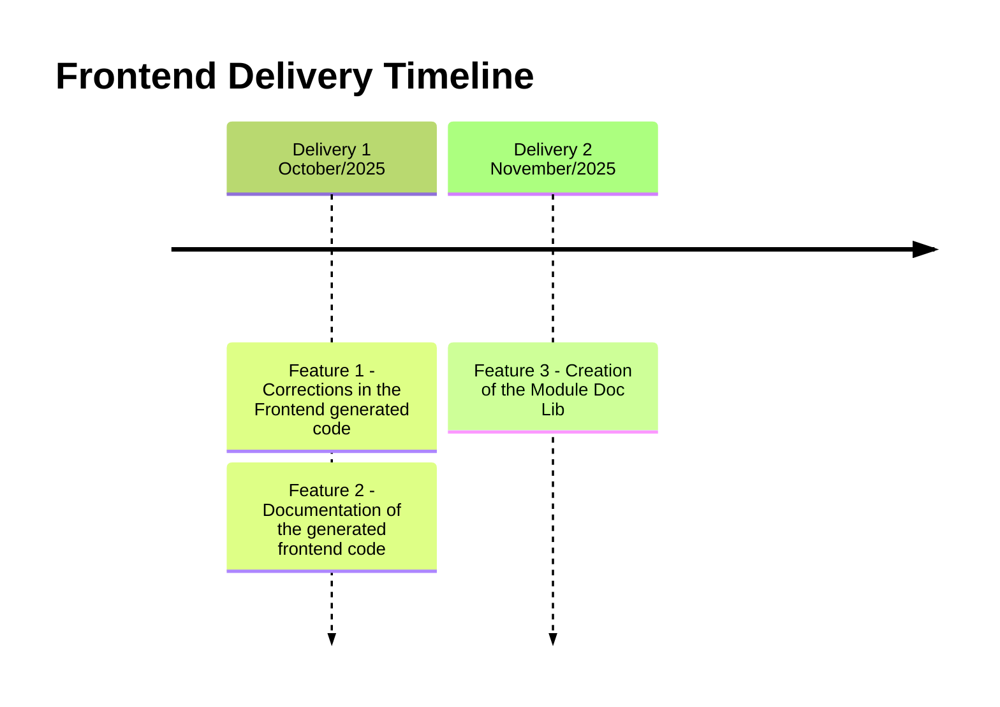

# Project's Developing Plan

## Backlog - Frontend

| ID | Feature | Description | Importance | Proposal |
|----|---------|-------------|------------|----------|
| 1 | Corrections in the frontend generated code | Corrections in the new frontend generation so it runs properly without the necessity of user made corrections | 100 | Frontend works properly |
| 2 | Documentation of the frontend generated code | Addition of the generation of the documentation for the frontend generated code | 90 | Documented frontend code generation |
| 3 | Creation of the Module Doc Lib | Creation of a modular lib to centralize reusable components of the Spark-Lib and Andes-Lib | 95 | Reuseble modular lib for Spark and Andes |

## Frontend Development Plan (2025)

| ID | Description | Expected Time to Conclude (in weeks) | Related Feature |
|----|-------------|--------------------------------------|-----------------|
|  1 | Study of the generated frontend code | 1 | - |
|  2 | Corrections in the generated frontend code | 1 | 1 |
|  3 | Documentation of the generated frontend code | 2 | 2 |
|  4 | Creation of the Module Doc Lib | 4 | 3 |

## Timeline

