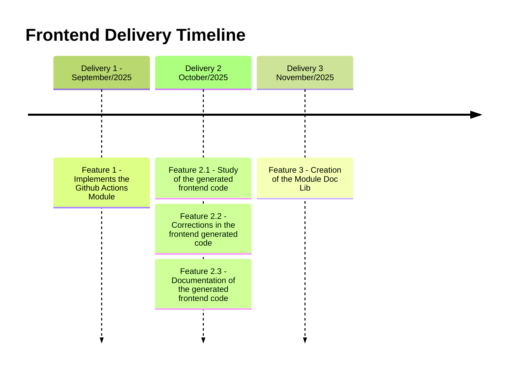

# Project's Developing Plan

## Important Dates
|    Date    | Description | Related Features |
|------------|-------------|------------------|
| 22/09/2025 | Start of the works with the team | not a delivery date |
| 28/09/2025 | First Delivery | 1 |
| 02/11/2025 | Second Delivery (First Big Delivery) | 2.1, 2.2 and 2.3 |
| 30/11/2025 | Third Delivery (Second Big Delivery) | 3 |

## Backlog - Frontend

|  ID | Feature | Description | Importance | Proposal |
|-----|---------|-------------|------------|----------|
|  1  | Implements the Github Actions Module | Implementation of the generation of the GitHub Actions for the generated code | 85 | Understand how compilers works and a bit about spark-lib architecture |
| 2.1 | Generate a example case | Generate a example case and document the frontend architecture | 80 | Better comprehension of the frontend architecture |
| 2.2 | Corrections in the frontend generated code | Corrections in the new frontend generation so it runs properly without the necessity of user made corrections | 100 | Generated frontend works properly from the start |
| 2.3 | Documentation of the frontend generated code | Addition of the generation of the documentation for the frontend generated code | 90 | Documented frontend code generation |
|  3  | Creation of the Module Doc Lib | Creation of a modular lib to centralize reusable components of the Spark-Lib and Andes-Lib | 95 | Reuseble modular lib for Spark and Andes |

## Frontend Development Plan (2025)

|  ID | Description | Expected Time to Conclude (in weeks) | Related Feature |
|-----|-------------|--------------------------------------|-----------------|
|  1  | Implements the Github Actions Module | 1 | 1 |
|  2  | Study of the generated frontend code, Corrections in the generated frontend code, Documentation of the generated frontend code | 4 | 2 |
|  3  | Creation of the Module Doc Lib | 4 | 3 |

## Timeline

