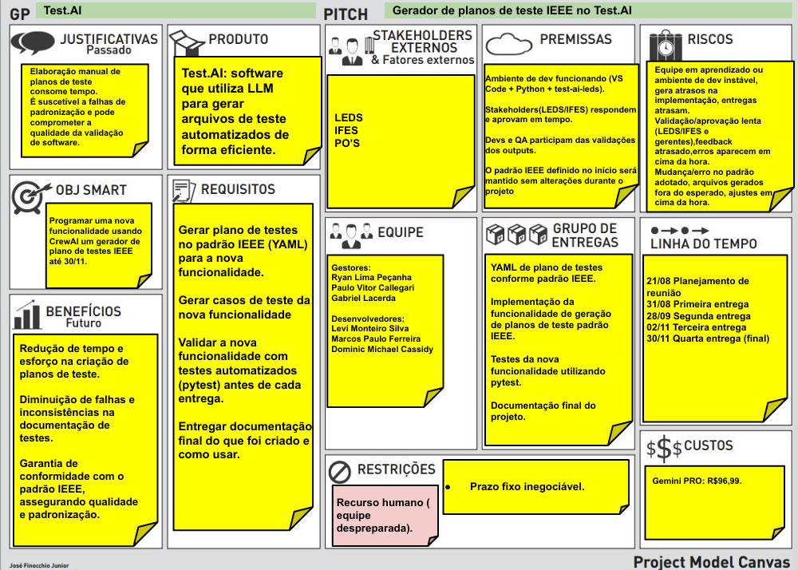

## Project Model Canvas

## DISC

### Gerência de Projeto de Software

| Integrante       | Resultado                                         |
|------------------|--------------------------------------------------|
| Gabriel Lacerda  | Estabilidade    |
| Ryan             | Conformidade     |
| Paulo Vitor       | Estabilidade    |

---

#### Gabriel Lacerda

---

#### Ryan

---

#### Paulo Vitor

